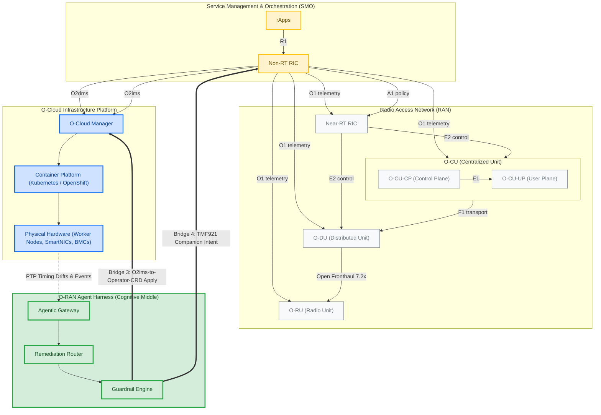

# O-RAN Standards Reference Landscape

This document contains a comprehensive architectural diagram mapping the global O-RAN reference topology and standardized interface conduits, explicitly highlighting the structural boundaries and active touchpoints of the **O-RAN Agent Harness**.

## Architectural Topology Diagram

The following Mermaid diagram visualizes the O-RAN standards landscape. The styling highlights **active conduits** (interfaces traversed or bridged by the harness), **boundary seams** (respected interfaces used for scoping), and **out-of-scope baselines** (radio-real-time control and internal baseband interfaces).

---

## Interface Definition Directory

### 1. Active Harness Touchpoints (In-Scope)
*   **O2ims (Infrastructure Management Services):** Connecting the SMO down to the O-Cloud Manager. The harness routes infrastructure remediation proposals (reboots, driver updates, firmware pushes) down this conduit.
*   **O1 (FCAPS Control Plane):** Consumed in the harness's left loop. Precision timing anomalies and platform events are ingested as standard `FaultPayload` objects.
*   **TMF921 / TMF688 (TM Forum Intent & Audit):** Used by the harness to register TMF921-shaped intent requests for dual-route coordination and write TMF688-shaped audit events for human co-authorization.

### 2. Isolated Boundaries & Seams (Respected/Prospective)
*   **R1 Interface:** Standard API boundary connecting rApps to the Non-RT RIC framework. The harness marks this as a prospective Bridge 7 seam for v1 packaging.
*   **O2dms (Deployment Management Services):** Responsible for scaling software containers (vDUs/vCUs). Explicitly bypassed, as the harness handles infrastructure remediation, not deployment lifecycle.

### 3. Baseband & Real-Time Control (Out-of-Scope)
*   **A1 / E2 Interfaces:** Used for real-time edge radio optimization. Marked out-of-scope to enforce strict layer-boundary discipline.
*   **E1 / F1 / Open Fronthaul:** Internal baseband transport protocols. The harness monitors physical synchronization status from the Open Fronthaul boundary but does not intercept the transport packets.
