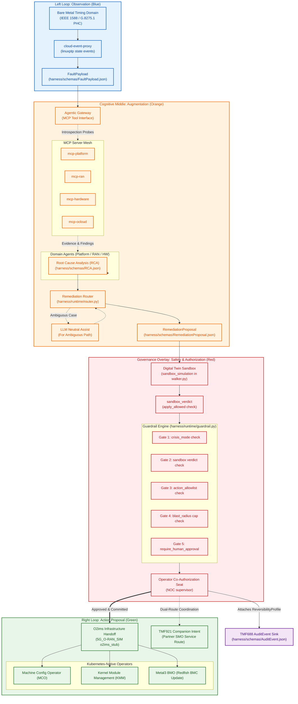

# The Three-Loop Harness Architecture

This document maps the functional control-loop sequence of the **O-RAN Agent Harness**. It details the flow of data from raw physical telemetry, through agentic diagnostic aggregation, down to policy-gated infrastructure execution and human co-authorization.

## Functional & Control Loop Diagram

The following Mermaid diagram visualizes how physical signals are compressed into actionable evidence, routed deterministically, evaluated against safety policies, and delivered to operational systems under a strict human governance overlay.

---

## Component-to-Loop Directory

### 1. Left Loop (Observation)
*   **Signal Processing:** The precision timing hardware domain streams local synchronization state.
*   **Eventing:** The `cloud-event-proxy` sidecar watches the state and publishes structured CNCF CloudEvents.
*   **The Interface:** The walker ingests this payload via the `FaultPayload` JSON Schema.

### 2. Cognitive Middle (Augmentation)
*   **Introspection Scaffolding:** The `Agentic Gateway` hosts four `Model Context Protocol` (MCP) server probes (`mcp-platform`, `mcp-ran`, `mcp-hardware`, `mcp-ocloud`) providing read-only system facts.
*   **Diagnosis:** Domain agents accumulate findings to write a unified Root Cause Analysis (`RCA.json`) artifact.
*   **Remediation Routing:** The `router.py` module evaluates the taxonomic rules, using provider-neutral LLMs only for ambiguous cases.

### 3. Governance Overlay (Safety)
*   **Digital Twin Sandbox:** The walker simulates execution against a clone topology in `sandbox_simulation()` to write a `sandbox_verdict`.
*   **Deterministic Policies:** The `guardrail.py` engine processes the `sandbox_verdict` and five structural checks declared in `guardrails.yaml`.
*   **Co-Authorization:** NOC operators retain absolute authority. They review the draft proposal, inspect the diagnostic evidence, and commit changes with the 7-field `ReversibilityProfile` appended.

### 4. Right Loop (Action)
*   **Infrastructure Handoff:** Dispatched via O-Cloud Manager stubs utilizing the **O-RAN O2ims** boundary towards Kubernetes controllers (`MCO`, `KMM`, or `Metal3`).
*   **Service Coordination:** Dispatched upward to the partner SMO using **TM Forum TMF921** intent models.
