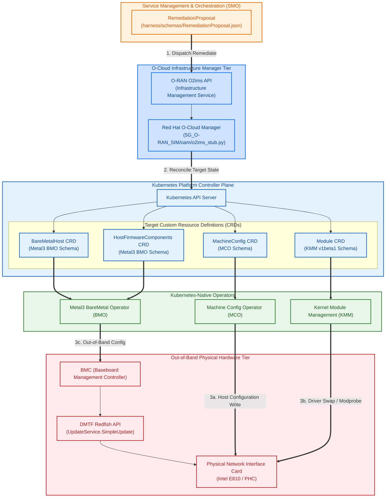

# The O2ims-to-Operator-CRD Bridge

This document details the **O2ims-to-Operator-CRD Bridge (Bridge 3)**. It zooms in on the crucial interface boundary where high-level, software-layer remediation proposals are translated and dispatched down to Kubernetes-native CRD controllers and physical hardware without inventing a parallel, non-standard control plane.

## Infrastructure Handoff Diagram

The following Mermaid diagram visualizes how a unified `RemediationProposal` is converted into standard O-RAN O2ims API calls and routed to dedicated cluster reconcilers and server BMCs.

---

## The Core Novelty: Architectural Composition

Existing closed-loop automation products frequently invent proprietary, vertical agent channels that bypass standard structures. The **O2ims-to-Operator-CRD Bridge** enforces a clean horizontal division of labor:

1.  **High-Level Taxonomy Routing:** High-level diagnostic facts are structured inside `RemediationProposal.json`.
2.  **O-RAN Standard Entry:** The SMO dispatches this proposal across the standardized **O-RAN O2ims API** boundary down to the local O-Cloud Manager.
3.  **Kubernetes-Native Translation:** The O-Cloud Manager translates the O2ims request into native Kubernetes resource manifests, avoiding any vendor-proprietary platform APIs.
4.  **Dedicated Reconciler Execution:** Three standard, pre-existing cluster operators handle the actual change:
    *   **MCO (`harness/routing-rules` / Scenario A):** Writes direct host OS configuration changes.
    *   **KMM (`harness/routing-rules` / Scenario A'):** Deploys out-of-tree hardware kernel modules for NIC driver swaps.
    *   **Metal3 BMO (`harness/routing-rules` / Scenario E):** Executes out-of-band firmware updates through BMCs via DMTF Redfish.
