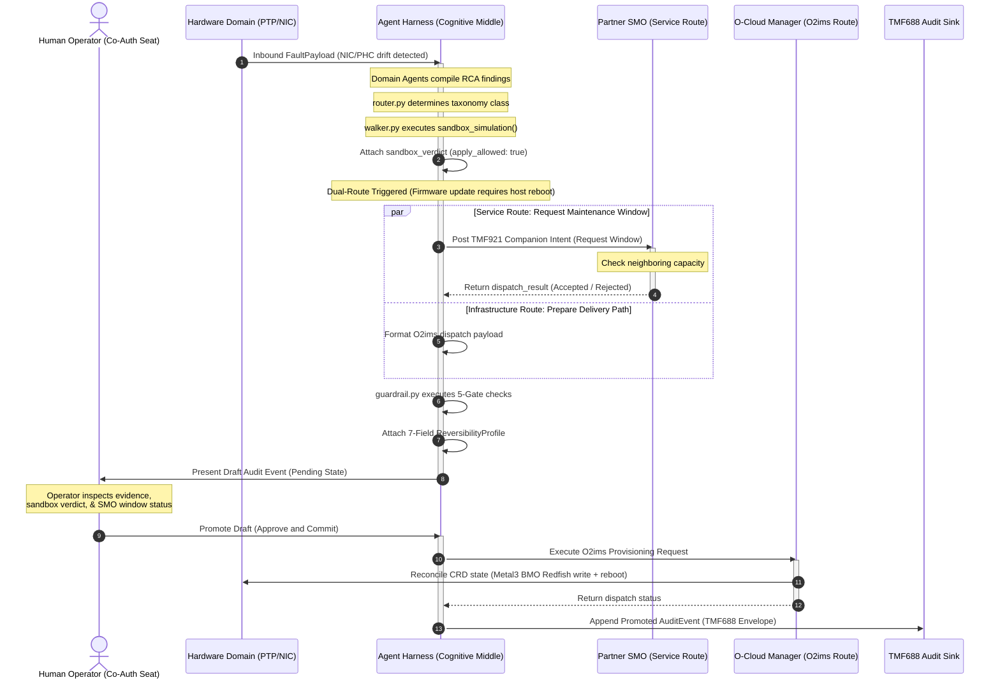

# Dual-Route Coordination Sequence

This document details the **Dual-Route Coordination Sequence (Bridge 4)**. It outlines the chronological sequence of events that occur when a critical physical infrastructure fault (such as a NIC firmware update in Scenario E) requires a service coordination maintenance window before physical execution is authorized.

## Logical Sequence Diagram

The following Mermaid sequence diagram maps out the asynchronous signal-to-remediation flow, showing how service-layer intents and infrastructure-layer dispatches are coordinated in parallel before landing at the human co-authorization seat.

---

## Chronological Walkthrough & Key Boundaries

### 1. Inbound Event Ingestion (Left Loop)
A physical timing or hardware fault surfaces on a bare-metal node. The `cloud-event-proxy` translates the state change into an O-RAN WG6 Cloud Notification and pushes a `FaultPayload` to the Agentic Gateway.

### 2. Sandbox Verification (Digital Twin)
Before making external network dispatches, the harness executes `sandbox_simulation()` within `walker.py`. It obtains a `sandbox_verdict` from the digital twin mirroring surface. If `apply_allowed` is `False`, the loop is terminated immediately.

### 3. Parallel Dual-Route Action (The Seam)
Because a NIC firmware update requires offline host reboots, the harness initiates parallel operations:
*   **The Service Route:** A **TM Forum TMF921** Companion Intent is emitted to the Partner SMO. The partner SMO checks neighboring cells (Scenario E' is accepted; Scenario E'' is rejected because neighboring capacity is already at 92 percent).
*   **The Infrastructure Route:** The draft **O-RAN O2ims** dispatch parameters are packaged.

### 4. Human-Governed Co-Authorization
The `guardrail.py` engine processes the outputs, attaches the **7-field Reversibility Profile**, and blocks physical dispatch. The NOC Operator reviews the draft, inspects the SMO's maintenance window decision, and commits (promotes) the action, prompting live O2ims execution and TMF688 audit storage.

### Scenario E and E-with-SMO-reject Nuance
The dual-route pattern is parallel emission, not hidden two-phase commit. Scenario E sends the infrastructure preparation down through O2ims while the companion service context goes up through TMF921. Scenario E-with-SMO-reject keeps the same infrastructure-side sandbox verdict but captures `dispatch_result.accepted=false` from the partner SMO. That rejection lands in the AuditEvent before operator co-authorization, so the operator sees both facts at once: the twin says the payload can land, and the SMO says the service window is not safe yet.
