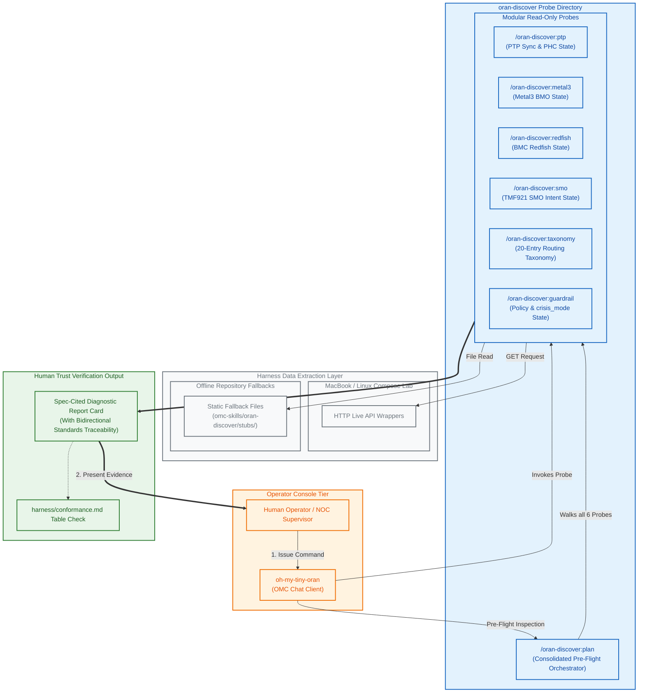

# The Operator Inspection & Discovery Surface

This document details **The Operator Inspection & Discovery Surface (The Read-Before-Write Layer)**. It illustrates how the operator-facing inspection surface at `omc-skills/oran-discover/` leverages six modular probes and one orchestrator to compile clear, spec-cited diagnostic evidence before executing mutating actions on the O-Cloud.

## Human-in-the-Loop View Diagram

The following Mermaid diagram visualizes the structural wiring of the `/oran-discover` chat-and-probe interface. It maps how command inputs read from live lab wrappers or static repo fallbacks to return human-readable diagnostic cards.

---

## The Read-Before-Write Philosophy

To establish human trust, the harness enforces a **strict split between read-only discovery probes and write-capable remediation execution**:

The `/oran-discover` commands are deliberately read-before-write. They inspect PTP state, Metal3 state, Redfish state, SMO intent state, taxonomy, and guardrails; they do not apply remediation. The assistant can use those surfaces to explain the environment, but write-capable action remains behind the harness-walker, guardrail engine, sandbox verdict, AuditEvent, and operator co-authorization path.

### 1. The Six Discovery Probes
*   **`:ptp` (`ptp.md`):** Collects raw PTP synchronization events, PHC offsets, and `cloud-event-proxy` states, explaining their **IEEE 1588 / G.8275.1** lineage.
*   **`:metal3` (`metal3.md`):** Inspects host platform and bare-metal firmware states behind **O-RAN O2ims** shapes.
*   **`:redfish` (`redfish.md`):** Verifies out-of-band server BMC statuses without exposing direct writing APIs.
*   **`:smo` (`smo.md`):** Inspects TMF921-shaped intent envelopes and active maintenance window timelines.
*   **`:taxonomy` (`taxonomy.md`):** Exposes the 20-entry routing taxonomy, validating the O-Cloud layer boundaries.
*   **`:guardrail` (`guardrail.md`):** Checks policy caps, allowlists, and whether the NOC supervisor has toggled `crisis_mode`.

### 2. Pre-Flight Orchestration (`:plan`)
Before any remediation write is authorized, the operator invokes `/oran-discover:plan`. This probe runs a sequential pre-flight check across all six probes, compiling their outputs into a single diagnostic report card. The operator can visually inspect this card, confirm that the evidence supports the proposed fix, and promote the remediation proposal with confidence.
